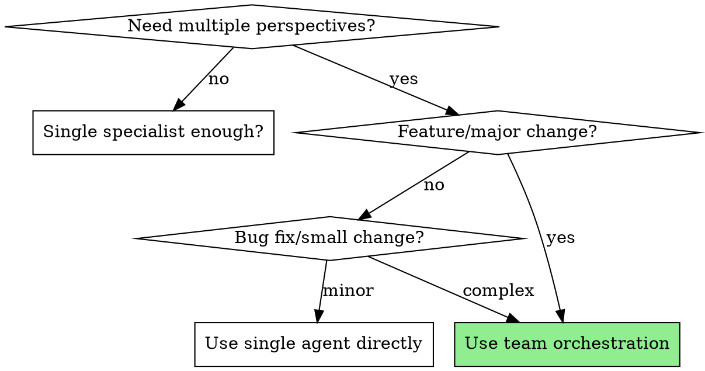
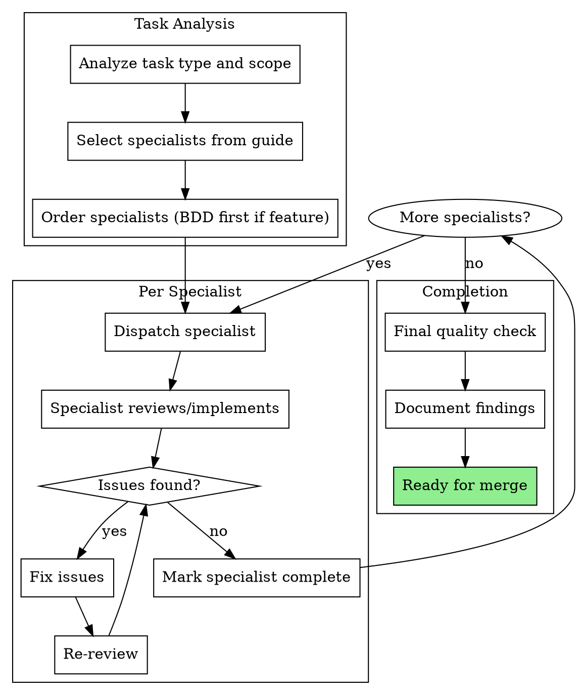
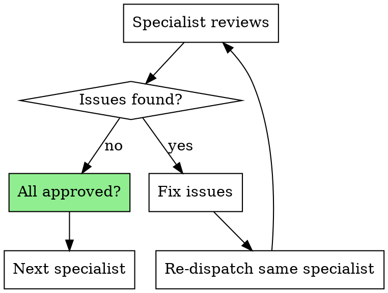

# Team Orchestration

Coordinate pragmatic-dev-team specialists for complex tasks requiring multiple reviews and perspectives.

**Core principle:** Right specialist → Right order → Review loops until approved = Production-ready code

## When to Use



**Use team orchestration for:**
- New features (requires BDD + architecture + code review)
- Refactoring (architecture + refactoring advisor + code review)
- Bug fixes affecting architecture
- Test coverage improvements
- Performance optimizations with architectural impact

**Use single specialist for:**
- Simple bug fixes
- Documentation updates
- Minor test additions
- Isolated code cleanup

## The Process



## Specialist Selection Guide

| Task Type | Specialists (in order) | Notes |
|-----------|------------------------|-------|
| **New Feature** | 1. bdd-strategist<br>2. architect<br>3. developer/implementer<br>4. review (code-reviewer)<br>5. test-plan (if needed) | BDD defines acceptance, architecture ensures fit, code review validates quality |
| **Bug Fix (Complex)** | 1. review (code-reviewer)<br>2. architect (if architectural)<br>3. test-plan | Understand impact first, ensure fix doesn't break design |
| **Bug Fix (Simple)** | 1. review (code-reviewer) | Single review sufficient |
| **Refactoring** | 1. architect<br>2. developer/implementer<br>3. review (code-reviewer) | Architecture validates direction, code review ensures quality |
| **Performance** | 1. review (code-reviewer)<br>2. architect<br>3. developer/implementer | Identify bottlenecks, ensure architectural soundness |
| **Test Coverage** | 1. test-plan<br>2. review (code-reviewer) | Strategy first, implementation review second |
| **Architecture Review** | 1. architect<br>2. review (code-reviewer) | Design validation, then code quality |
| **Tech Debt** | 1. review (code-reviewer)<br>2. architect<br>3. developer/implementer | Identify issues, plan solution, implement |
| **Research/Spike** | 1. research | Compare options, recommend approach |

## Specialist Capabilities

| Specialist | When to Use | Outputs |
|------------|-------------|---------|
| **bdd-strategist** | Defining feature behavior | BDD scenarios (Gherkin) |
| **architect** | Architecture decisions, DDD patterns | Design recommendations, boundary validation |
| **review (code-reviewer)** | Code quality, patterns, best practices | Issues list, recommendations |
| **test-plan** | Test strategy and coverage | Test plan, coverage gaps |
| **research** | Technical decisions, library comparisons | Comparison matrix, recommendations |
| **team** | Comprehensive multi-specialist review | Coordinated specialist reports |

## Workflow Example

### New Feature: Document Template Validation

```
Task: Add validation for template fields

1. **BDD Strategist** (bdd-strategist)
   Dispatch: "Define BDD scenarios for template field validation"
   Output:
   - Given/When/Then scenarios
   - Acceptance criteria
   - Edge cases identified
   Issues: None
   ✅ Approved

2. **Architect** (architect)
   Dispatch: "Review architecture for template validation feature"
   Output:
   - Validation should be in Domain layer
   - Use Specification pattern
   - Aggregate boundary: Template aggregate
   Issues:
   - ❌ Current ValidationService in wrong layer
   Fix: Move ValidationService → Domain layer
   Re-review:
   ✅ Architecture now correct

3. **Implementation**
   [Developer implements based on BDD scenarios + architecture guidance]

4. **Code Review** (review)
   Dispatch: "Review template validation implementation"
   Output:
   - Strengths: Good test coverage, follows DDD
   Issues:
   - ❌ Magic strings for error messages
   - ❌ Missing null checks
   Fix: Extract constants, add guards
   Re-review:
   ✅ Code quality approved

5. **Test Coverage** (test-plan) [Optional if complex]
   Dispatch: "Verify test coverage for template validation"
   Output:
   - Unit tests: ✅ Complete
   - Integration tests: ✅ Complete
   - Edge cases: ✅ Covered
   Issues: None
   ✅ Coverage complete

Result: Feature ready for merge
```

### Bug Fix: Null Reference Exception

```
Task: Fix null reference in ribbon command handler

1. **Code Review** (review)
   Dispatch: "Analyze null reference bug in ribbon handler"
   Output:
   - Root cause: Document property accessed before null check
   - Impact: Medium (crashes on startup if no document)
   - Fix: Add guard clause
   Issues: None (analysis complete)
   ✅ Approved

2. **Architect** (architect) [Only if architectural impact]
   Skip: Simple guard clause, no architectural impact

3. **Test Coverage** (test-plan)
   Dispatch: "Ensure test coverage for null document scenario"
   Output:
   - Add test: RibbonCommandWithNoDocument
   - Verify: Existing tests didn't catch this
   Issues: None
   ✅ Test plan approved

Result: Bug fix ready for merge
```

## Review Loop Rules

**Critical:** Don't skip review loops when issues found.



**Rules:**
1. Specialist finds issues → Fix → Re-review (same specialist)
2. Don't move to next specialist until current ✅
3. Don't skip re-review ("I fixed it" ≠ verified fixed)
4. Architecture issues must be fixed before code review
5. BDD scenarios must be approved before implementation

## Red Flags - STOP

**Never:**
- Skip BDD strategist for "simple" features (simple now ≠ simple later)
- Run architecture review after code is merged (too late)
- Move to next specialist while current has open issues
- Skip test coverage check for bug fixes (regression risk)
- Let implementer self-review replace specialist review
- Start code review before architecture is ✅
- Approve "good enough" when specialist found issues
- Batch-fix multiple specialists' issues (fix per specialist, verify, then next)

**If specialist finds issues:**
1. STOP - don't proceed
2. Fix issues (one specialist at a time)
3. Re-dispatch same specialist
4. Verify fixes before moving on
5. Repeat until ✅

**If skipping a specialist:**
- Document WHY (too risky otherwise)
- Example: "Skipping architect - cosmetic change only"

**If task is unclear:**
- Use research specialist first
- Clarify scope before dispatching team

## Integration with Other Skills

**Use before team orchestration:**
- **research** - When technical approach is unclear
- **BDD scenarios** - Write acceptance criteria first

**Use during team orchestration:**
- Specialists invoke their specific skills
- Each specialist has defined role and output

**Use after team orchestration:**
- Commit/PR workflows
- Merge to main

## Cost Considerations

**Higher cost (worth it):**
- Multiple specialist invocations
- Review loops add iterations
- More thorough analysis

**Catches early (saves cost):**
- Architecture issues before implementation
- Missing scenarios before coding
- Quality issues before merge
- Test gaps before production

**When to use lighter process:**
- Trivial changes (typos, comments)
- Documentation-only
- Emergency hotfixes (but add tech debt task)

## Success Criteria

Before marking complete:
- [ ] All selected specialists dispatched
- [ ] All specialists ✅ approved (no open issues)
- [ ] Review loops completed for any issues found
- [ ] BDD scenarios approved (if feature)
- [ ] Architecture validated (if architectural impact)
- [ ] Code quality approved
- [ ] Test coverage verified (if appropriate)
- [ ] Documented any skipped specialists with reason

## Example Orchestration Commands

```bash
# Full feature workflow
/team              # Analyzes task, dispatches all needed specialists
/bdd-strategist    # Just BDD scenarios
/architect         # Just architecture review
/review            # Just code review

# Sequence for new feature
1. /bdd-strategist "Define validation scenarios"
2. /architect "Review validation design"
3. [implement]
4. /review "Review validation implementation"
5. /test-plan "Verify test coverage"

# Sequence for bug fix
1. /review "Analyze null reference bug"
2. [fix]
3. /test-plan "Add regression test"

# Research before deciding
1. /research "Compare validation libraries"
2. [Based on research output]
3. /bdd-strategist "Define scenarios using chosen approach"
```

## Anti-Patterns

**Don't:**
- Orchestrate when single specialist is enough
- Skip specialists to "move faster" (moves slower later)
- Batch all fixes then review (fix → review → fix → review)
- Use team orchestration for documentation typos
- Let one specialist override another without resolution
- Proceed with unresolved conflicts between specialists

**Do:**
- Match specialist selection to task complexity
- Follow review loops religiously
- Document specialist findings
- Escalate conflicts between specialists
- Use lighter process when appropriate
- Add skipped specialists to tech debt if rushed
