# Diagrams as Code

Create maintainable diagrams with Mermaid and C4 model.

## When to Use Diagrams

| Diagram Type | Use When |
|-------------|----------|
| Architecture overview | Explaining system boundaries |
| Sequence diagram | Showing API flows, interactions |
| Flowchart | Decision logic, process flows |
| State diagram | Lifecycle, state machines |
| ER diagram | Data models |

---

## Mermaid Basics

### Flowchart

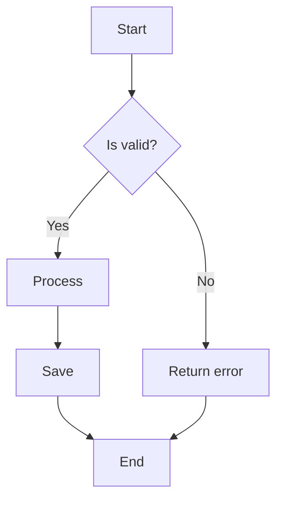

```markdown
\`\`\`mermaid
flowchart TD
    A[Start] --> B{Is valid?}
    B -->|Yes| C[Process]
    B -->|No| D[Return error]
    C --> E[Save]
    E --> F[End]
    D --> F
\`\`\`
```

### Sequence Diagram

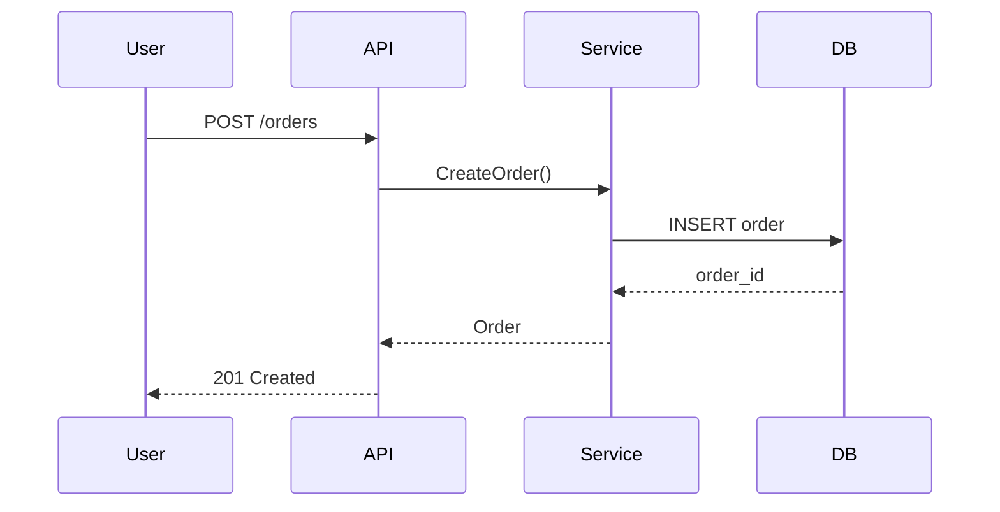

```markdown
\`\`\`mermaid
sequenceDiagram
    participant User
    participant API
    participant Service
    participant DB

    User->>API: POST /orders
    API->>Service: CreateOrder()
    Service->>DB: INSERT order
    DB-->>Service: order_id
    Service-->>API: Order
    API-->>User: 201 Created
\`\`\`
```

### State Diagram

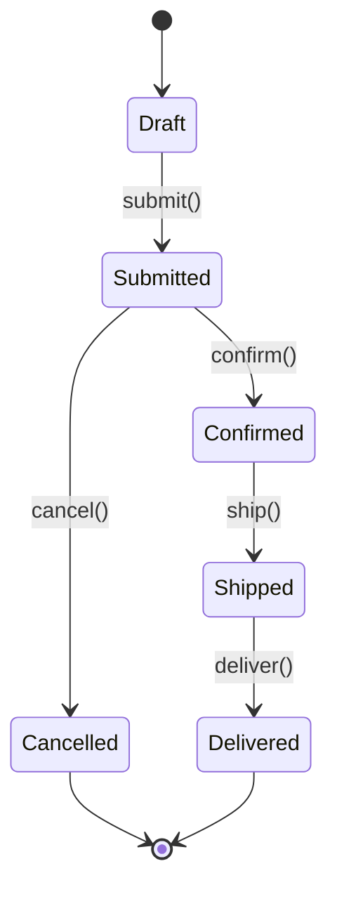

```markdown
\`\`\`mermaid
stateDiagram-v2
    [*] --> Draft
    Draft --> Submitted: submit()
    Submitted --> Confirmed: confirm()
    Confirmed --> Shipped: ship()
    Shipped --> Delivered: deliver()
\`\`\`
```

---

## C4 Model with Mermaid

### Context Diagram (Level 1)

Shows the big picture - system and external actors.

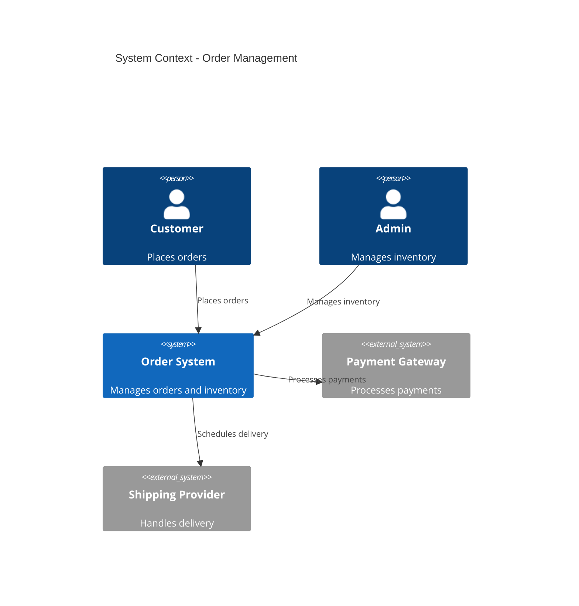

### Container Diagram (Level 2)

Shows the high-level technical building blocks.

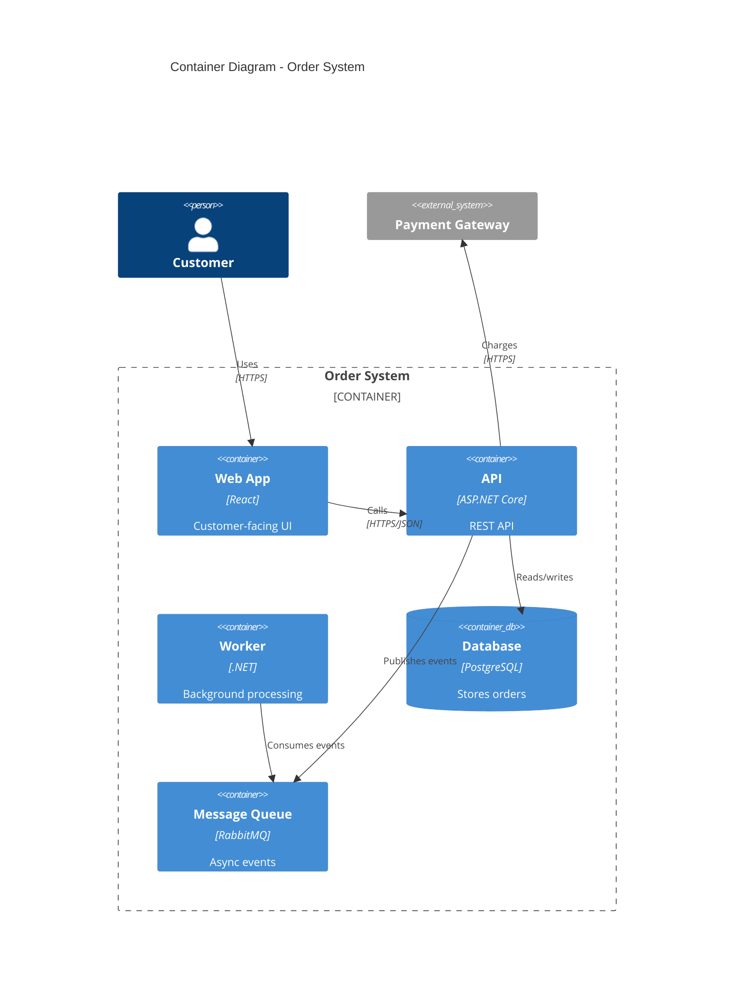

---

## Diagram Best Practices

### Keep It Simple

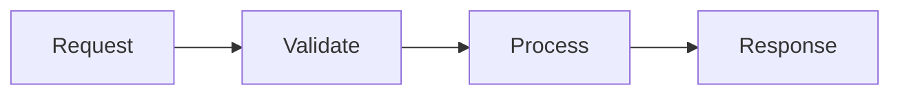

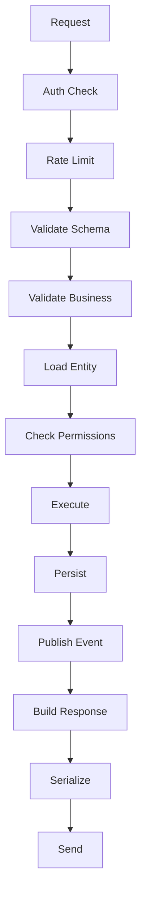

### Use Subgraphs for Grouping

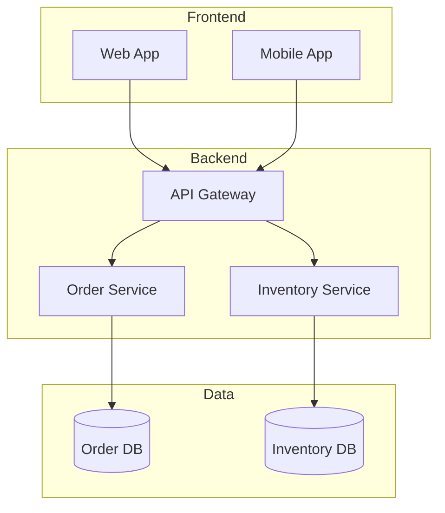

---

## When NOT to Use Diagrams

| Skip Diagram When | Instead |
|-------------------|---------|
| Code is self-explanatory | Good naming, small functions |
| Diagram would duplicate code | Link to source |
| Relationships are simple | Text description |
| High maintenance burden | Simpler representation |

---

## Markdown Integration

### GitHub-Flavored Markdown

```markdown
## Architecture

The system uses a microservices architecture:

\`\`\`mermaid
flowchart LR
    A[API Gateway] --> B[Order Service]
    A --> C[User Service]
    B --> D[(Orders DB)]
    C --> E[(Users DB)]
\`\`\`

See [detailed architecture](./architecture.md) for more.
```

### Linking Diagrams

```markdown
## Overview

See the [Context Diagram](#context-diagram) for system boundaries.

## Context Diagram

\`\`\`mermaid
C4Context
    ...
\`\`\`

## Details

For implementation details, see:
- [Container Diagram](./containers.md)
- [Component Diagram](./components.md)
```

---

## Tool Comparison

| Tool | Strengths | Limitations |
|------|-----------|-------------|
| **Mermaid** | Git-friendly, GitHub renders | Limited styling |
| **PlantUML** | Full UML support | Needs server/plugin |
| **Structurizr** | Full C4 support | Paid for advanced |
| **draw.io** | Rich UI | Binary files |

---

## Common Patterns

### API Flow

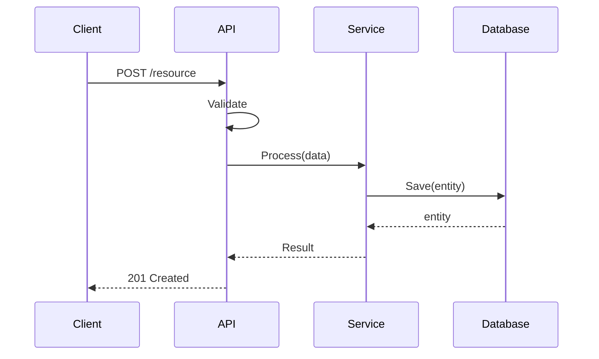

### Event-Driven

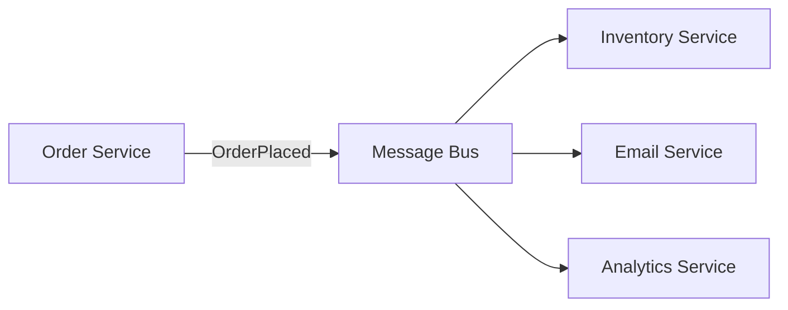

### Decision Flow

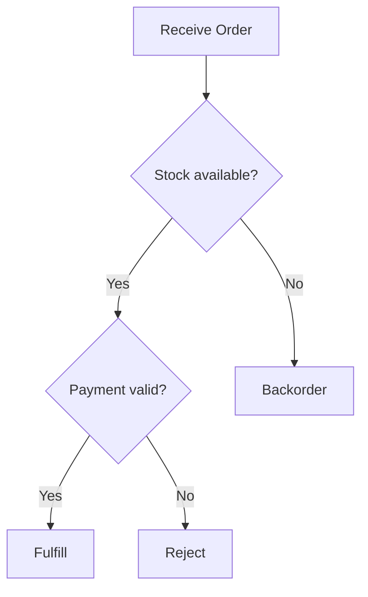

---

## Anti-Patterns

| Anti-Pattern | Problem | Fix |
|--------------|---------|-----|
| Too much detail | Unreadable | One aspect per diagram |
| No legend | Confusing | Add key/description |
| Binary images | Can't version | Use Mermaid/PlantUML |
| Stale diagrams | Misleading | Update with code changes |
| Diagram without text | Missing context | Add explanatory prose |

---

## Quick Reference

### Mermaid Shapes

```
[Rectangle]     Rectangle node
(Rounded)       Rounded rectangle
{Diamond}       Decision diamond
[(Database)]    Database shape
((Circle))      Circle
>Asymmetric]    Asymmetric
```

### Arrow Types

```
-->   Solid arrow
---   Solid line
-.-   Dashed line
-.->  Dashed arrow
-->>  Solid with arrowhead (async)
```

## Sources

- [Mermaid Documentation](https://mermaid.js.org/)
- [C4 Model](https://c4model.com/)
- [Building C4 Diagrams with Mermaid](https://lukemerrett.com/building-c4-diagrams-in-mermaid/)
- [PlantUML](https://plantuml.com/)
